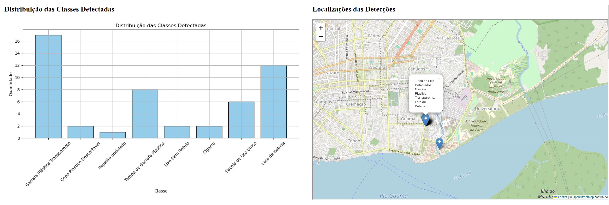
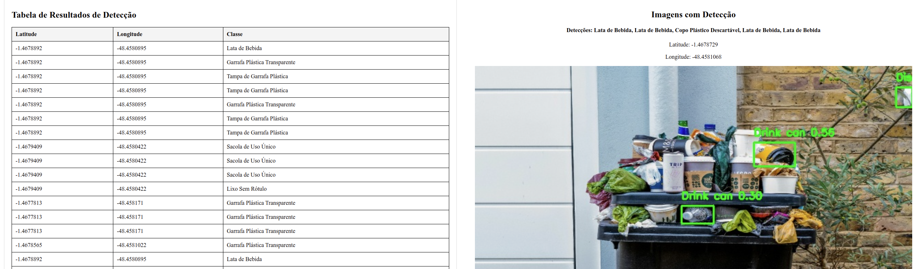

Aplicação de Visão Computacional no Desenvolvimento de Ferramentas para a Gestão Sustentável de Resíduos Urbanos (Projeto de Engenharia 2)

Alunos: 
- Jean Dias: 202306840056
- Miguel Ângelo: 202406840022
- Carlos Vitelli: 202406840030
- Kayky Feio: 202406840021
- Flávio Leite: 202406840019

## Introdução 
- Este projeto integra o uso de tecnologias modernas, como Flutter e Firebase, para desenvolver um aplicativo móvel que permite à população denunciar acúmulos de lixo irregulares na cidade. O sistema captura imagens dos resíduos descartados inadequadamente e utiliza modelos de aprendizado de máquina para classificar os tipos de resíduos, facilitando a identificação de pontos críticos de descarte irregular e auxiliando na tomada de decisões para a gestão sustentável dos resíduos urbanos.

## Métodos usados (Linguagens de programação, bibliotecas, frameworks,...)
1. Flutter: Foi usada a linguagem de programação Flutter para moldar a interface do aplicativo;
2. Firebase: Foi utilizado para armazenar as imagens e registrar informações no banco de dados;
3. Yolov11s: Utilizado para detecção dos resíduos;
4. Flask: Funciona como um backend intermediário, recuperando imagens do Firebase, processando-as com YOLOv11s e servindo os resultados para um dashboard.

## Imagens da API e do APP

  
  
  
  

## Referências Bibliográficas
JOCHER, Glenn; QIU, Jing. Ultralytics YOLO11. Versão 11.0.0. 2024. Disponível em: https://github.com/ultralytics/ultralytics.
PROENÇA, Pedro F.; SIMÕES, Pedro. Taco: Trash annotations in context for litter detection. arXiv preprint arXiv:2003.06975, 2020.

