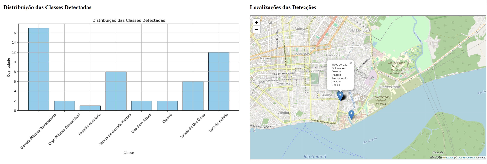
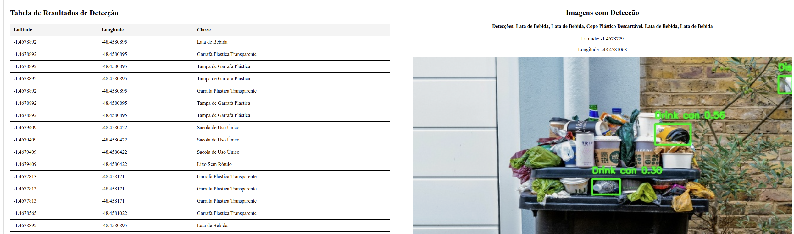

# Tutorial API

Este guia fornece instruções básicas para configurar e utilizar a API.

## Autenticação com Firebase

Para autenticar com o Firebase, coloque o token privado .json do Firebase na pasta `/api/token`.

## Modificação do Modelo YOLO

Se você deseja alterar o modelo YOLO treinado, odifique o conteúdo da pasta `/api/model` com o novo modelo YOLO treinado.

## Inicialização do Servidor

Para iniciar o servidor, execute os seguintes comandos no terminal:

1. **Navegue até a Pasta da API**: ```cd /api```
2. **Inicie o Servidor Flask**: ```flask --app app run --debug```

## Realizando uma nova inferência
Caso queira realizar uma nova inferência para testes, exclua o arquivo resultados_inferencia.json que está dentro da pasta /api

## Imagens do Dashboard

<p align="center">
  
  
</p>
